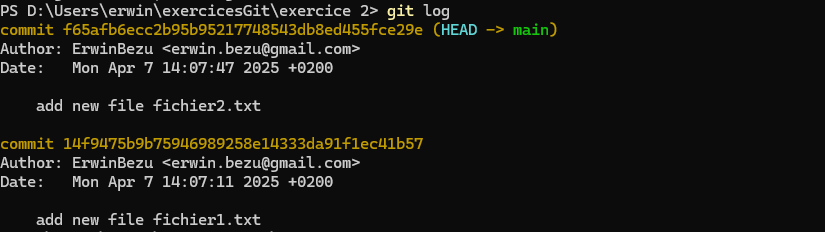
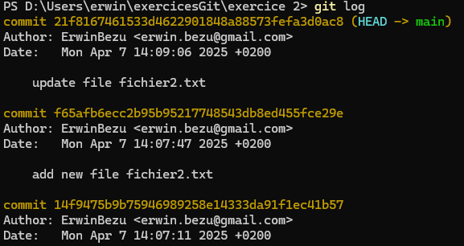
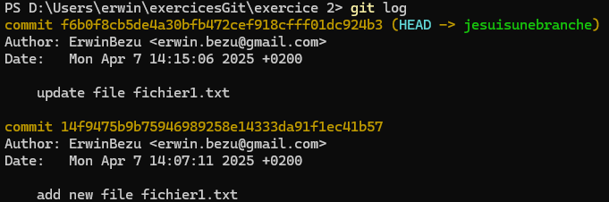
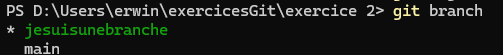

Créer un nouveau repository Git

```
git init
```

Ajouter un fichier et le commiter

```
git add .
git commit -m "add new file fichier1.txt"
```

Ajouter un deuxième fichier et le commiter

```
git add .
git commit -m "add new file fichier1.txt"
```

Vérifier l’historique (on doit avoir 2 commits)

```
git log
```



Faire des modifications sur le deuxième fichier et le commiter

```
git commit -am "update file fichier2.txt"
```

Vérifier l’historique (on doit avoir 3 commits)

```
git log
```



Créer une branche à partir du 1er commit

```
git branch jesuisunebranche 14f9475b9b75946989258e14333da91f1ec41b57
```

Faire un commit sur la branche

```
git checkout jesuisunebranche
git add .
git commit -m "update file fichier1.txt"
```

Vérifier l’historique de la branche (on doit avoir 2 commits)

```
git log
```



Lister les branches (on doit avoir 2 branches)

```
git branch
```



Tagger la version

```
git tag V0.0.1
```

Revenir au sommet de la branche main ou 'master'

```
git checkout main
```

Lister les tags (on doit avoir un tag)

```
git tag
```


Supprimer la branche

```
 git branch -D jesuisunebranche
```
