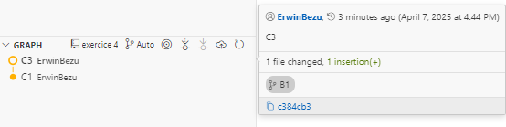

Créer un nouveau repository Git

```
git init
```

Ajouter un fichier et le commiter (C1), le modifier et le commiter (C2)

```
git add .
git commit -m "C1"
git add .
git commit -m "C2"
```

Créer une branche B1 à partir de C1

```
git log
git checkout -b B1 cd021398193d82f03db9d248f24eefce3d84e229
```

ou

```
git checkout -b B1 HEAD~1
```

Faire une modification du fichier et commiter C3

```
git add .
git commit -m "C3"
```

Rebase B1 dans main de manière à avoir un historique linéaire

```
git checkout main
git rebase B1
```


